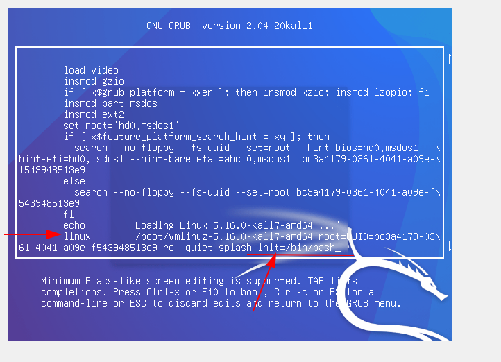

# Recover your Kali Linux after...
A friend had issues with their Kali installation recently and decided to help.

They had accidentally deleted the `/etc/passwd` file from their system and now they cant do anything.

So after helping them (_not solve their problem_ 🤣) this guide came out, in hopes it will help others.

<h2>Table of Contents</h2>

- [Recover your Kali Linux after...](#recover-your-kali-linux-after)
  - [... deleting your `/etc/passwd`](#-deleting-your-etcpasswd)
  - [... deleting your `/etc/shadow`](#-deleting-your-etcshadow)
  - [Single user mode on Linux](#single-user-mode-on-linux)

## ... deleting your `/etc/passwd`
Ok so somehow you ended up with either a corrupt or non existent `/etc/passwd` file and you see something like this


Not to worry things are fairly easy to fix. Boot into [single user mode](#single-user-mode-on-linux)

Once the system is booted you can recover your password file from a previous backup and adapt to your needs.

Best case scenario all you have to do is the following


The steps you need to do are as following:
1. get the numeric id/gid numbers from your home folder and write them down (most likely `1000` for both but could be different)
```shell
root@(none):/# ls -lan /home
drwxr-xr-x 49 1000 1000 4096 May 23 22:39 username
              ^^^^ ^^^^                   ^^^^^^^^
               UID GID                    HOME
```
2. mount your file system as read-write since by default the line you modified had the `ro` (read-only) option
```shell
root@(none):/# mount -o rw,remount /
```
3. check the system backup and confirm its contents (eg make sure your id or username is not already there like the following example)


Now depending on whether or not your details exist or not in the backup file you have to
* If the backup file includes your id already, simply copy the backup over to your passwd
```shell
root@(none):/# cp -p /etc/passwd- /etc/passwd
```
* if your user id is there but with a different username (eg `kali`) copy the contents excluding the offending UID
```shell
root@(none):/# grep -v 1000 /etc/passwd- > /etc/passwd
```
* if neither your username nor your user id is there simply add a new entry (also if you did the `grep -v` case above)
```shell
root@(none):/# echo "username:x:1000:1000::/home/username:/usr/bin/zsh" >> /etc/passwd
```

Reboot your system and you should be up and running.

If you reboot and the system gets stuck at loading gnome or other similar services then you mixed some UID and/or GID numbers.
* check again that there is only 1 entry with your username and UID number
* check the entries for typos or missing `:`
* check your come folder matches your uid/gid numbers and change them to match `chown -R 1000.1000 /home/username`

... if you still didnt recover then you messed more than just your `/etc/passwd` file 🤣

## ... deleting your `/etc/shadow`


## Single user mode on Linux
Most of the recovery options that follow depend on entering in single user mode. The process for booting into it is as follows

1. Reboot your system and right after the Kali boot screen apears press the Escape key to stop the automatic boot.
2. You will be presented with a menu similar to the following. Highlight the first option and press `e` (edit)

3. You will then be presented with the various grub settings for this option. Move by pressing the arrow keys and go to the line starting with `linux /boot`, go at the end of the line and add ` init=/bin/bash` like the screenshot, and press Ctrl+X or F10

